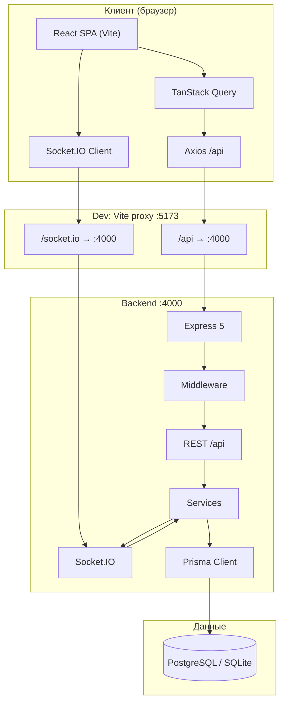
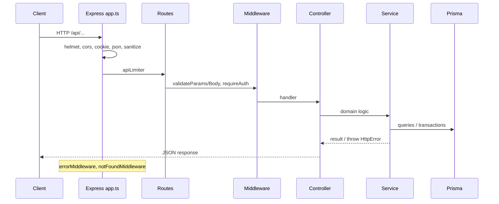
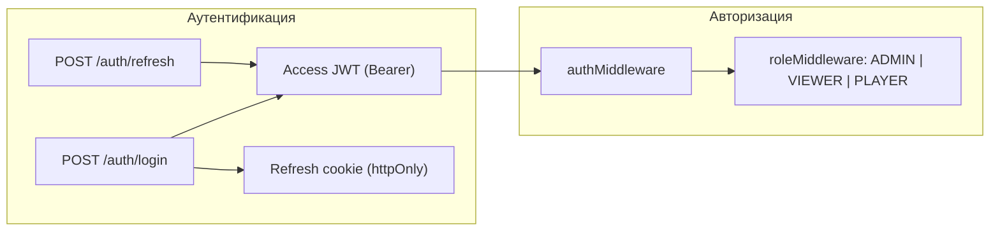
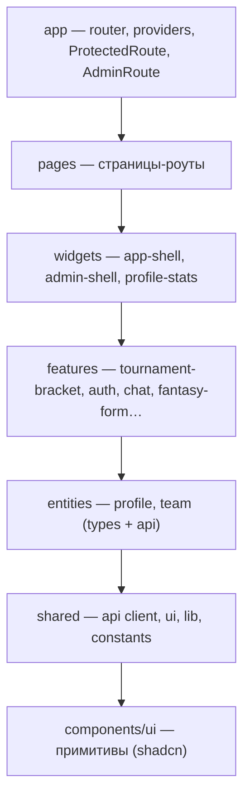
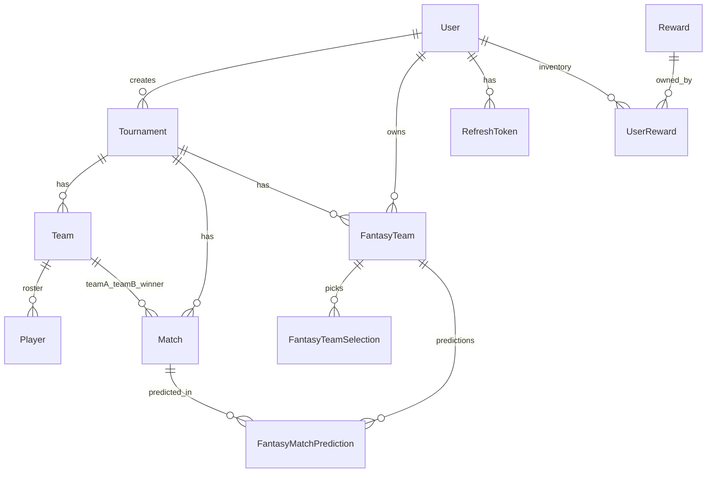
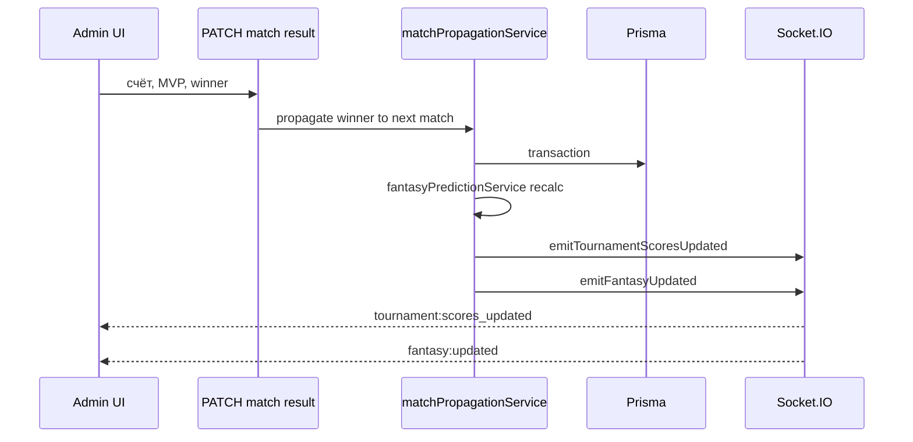
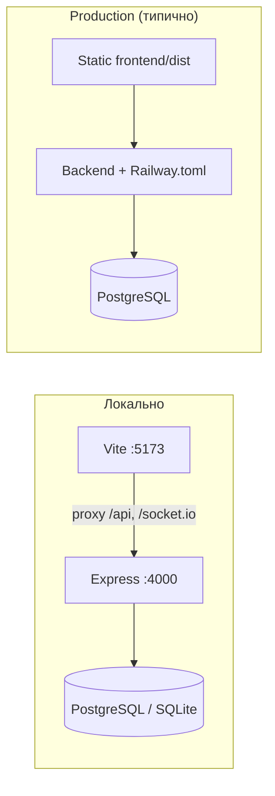

# Архитектура проекта Tour

Веб-платформа для управления киберспортивными турнирами: каталог, сетка матчей, составы команд, fantasy-лига, магазин наград за fantasy points, админ-панель и real-time (чат, обновления сетки).

---

## 1. Обзор системы



| Слой | Стек |
|------|------|
| **Монорепозиторий** | Корень: `concurrently` для `npm run dev`; пакеты `frontend/`, `backend/` |
| **Frontend** | React 19, TypeScript, Vite 8, React Router 7, TanStack Query, RHF + Zod, Tailwind, Radix, Framer Motion |
| **Backend** | Node.js, Express 5, Prisma 6, Zod, bcrypt, JWT, Socket.IO, Helmet, rate limiting |
| **БД** | Prisma ORM; в проде — PostgreSQL (`DATABASE_URL` в `.env.example`); в `schema.prisma` может быть указан `sqlite` для локальной разработки |

---

## 2. Структура монорепозитория

```text
Tour/
├── package.json                 # npm run dev — оба сервиса
├── docs/
│   └── ARCHITECTURE.md          # этот документ
├── backend/
│   ├── prisma/
│   │   ├── schema.prisma        # доменная модель
│   │   ├── migrations/          # SQL-миграции
│   │   └── seed.ts
│   └── src/
│       ├── index.ts             # HTTP + Socket.IO
│       ├── app.ts               # Express pipeline
│       ├── config/              # env (Zod)
│       ├── routes/              # маршрутизация API
│       ├── controllers/         # HTTP-обработчики
│       ├── services/            # бизнес-логика
│       ├── middleware/          # auth, roles, errors, rate limit
│       ├── validation/          # Zod-схемы запросов
│       ├── socket/              # real-time
│       ├── prisma/              # client, select-фрагменты
│       ├── errors/              # HttpError
│       └── utils/               # JWT, пароли, bracket helpers
└── frontend/
    └── src/
        ├── app/                 # router, providers, guards
        ├── pages/               # экраны (композиция)
        ├── widgets/             # крупные UI-блоки (shell, admin)
        ├── features/            # фичи (формы, чат, bracket)
        ├── entities/            # типы и API сущностей
        ├── shared/              # api client, ui, lib, hooks
        ├── layouts/             # RootLayout
        ├── components/ui/       # shadcn-примитивы
        ├── context/             # AuthContext
        └── services/            # socket, auth session bridge
```

---

## 3. Backend: слоистая архитектура

Поток обработки HTTP-запроса:



### 3.1. Точка входа

- `index.ts` — создаёт `http.Server`, подключает `app` и `initSocket(httpServer)`.
- `app.ts` — глобальные middleware, `/health`, монтирование `apiRouter` на `/api`.

### 3.2. Модули API (`/api`)

| Префикс | Назначение |
|---------|------------|
| `/auth` | register, login, refresh, logout (JWT access + httpOnly refresh cookie) |
| `/profile` | профиль пользователя, аватар, настройки |
| `/tournaments` | CRUD турниров, вложенные команды, игроки, bracket, матчи |
| `/teams` | глобальный список команд |
| `/matches` | лента матчей (hub) |
| `/fantasy` | fantasy-команды, прогнозы, лидерборд |
| `/fantasy-shop` | каталог наград, покупки, инвентарь |
| `/admin` | пользователи, турниры, магазин (роль ADMIN) |
| `/support` | обращения в поддержку |

Контроллеры тонкие: валидация уже пройдена, вызов сервиса, маппинг ответа. Сложная логика — в `services/`:

| Сервис | Ответственность |
|--------|----------------|
| `authService` | регистрация, refresh tokens |
| `tournamentService` | турниры, статусы, фильтры |
| `teamService` | команды и игроки |
| `bracketGenerationService` | генерация сетки |
| `bracketTeamSwapService` | перестановка слотов |
| `matchService` / `matchPropagationService` | результаты, продвижение победителя |
| `fantasyService` / `fantasyPredictionService` / `fantasyPointsService` | очки, прогнозы |
| `fantasyShopService` | покупки, баланс FP |
| `adminService` | админ-операции |
| `allMatchesFeedService` | агрегированная лента матчей |

После изменений сетки/матчей/fantasy сервисы вызывают функции из `socket/tournamentEmit.ts` для push клиентам.

### 3.3. Безопасность



- **Access token** — в заголовке `Authorization`, короткий TTL (`JWT_ACCESS_EXPIRES_IN`).
- **Refresh token** — хэш в БД (`RefreshToken`), cookie на клиенте; ротация при refresh.
- **Роли** (`UserRole`): `ADMIN` (управление), `VIEWER` (просмотр + fantasy), `PLAYER` (расширения профиля).
- Дополнительно: `helmet`, `hpp`, `mongoSanitizeExpress5`, rate limiters на `/api` и auth-эндпоинтах.

---

## 4. Frontend: Feature-Sliced Design (FSD)

Слои (сверху вниз — только импорт «вниз»):



### 4.1. Состав приложения

| Каталог | Роль |
|---------|------|
| `app/` | `AppProviders` (QueryClient, Auth), `router.tsx`, lazy-страницы, guards |
| `pages/` | один файл ≈ один маршрут; собирает widgets + features |
| `widgets/` | навигация, админ-layout, панели статистики |
| `features/` | изолированная бизнес-UI: формы, хуки API, bracket, чат |
| `entities/` | модель и тонкий API слой сущности |
| `shared/api/` | Axios instance, сервисы (`tournamentService`, `fantasyService`, …) |
| `context/AuthContext` | сессия, access token, login/logout |
| `services/` | Socket.IO, мост refresh для interceptor |

### 4.2. Данные на клиенте

- **Server state** — TanStack Query (`useXxxQuery`, `useXxxMutation`), ключи в `features/*/api/*QueryKeys.ts`.
- **Forms** — React Hook Form + Zod (`features/*/model/*Schema.ts`).
- **Auth** — `AuthContext` + interceptor в `shared/api/client.ts` (авто-refresh при 401).
- **Real-time** — хуки вроде `useChatChannel`, подписки на события турнира в feature-компонентах bracket/fantasy.

### 4.3. Маршрутизация (основные зоны)

| Зона | Пути | Доступ |
|------|------|--------|
| Публичная | `/`, `/tournaments`, `/tournaments/:id`, fantasy hub | без входа |
| Auth | `/login`, `/register` | гости |
| Пользователь | `/profile`, `/fantasy-shop` | `ProtectedRoute` |
| Админ | `/admin/*`, `/tournaments/new` | `AdminRoute` (ADMIN) |

---

## 5. Доменная модель (Prisma)



### 5.1. Ключевые сущности

| Модель | Смысл |
|--------|--------|
| `User` | аккаунт, роль, `fantasyPointsBalance` |
| `Tournament` | игра, формат, статус, настройки fantasy-прогнозов |
| `Team` / `Player` | участники турнира, ростер |
| `Match` | узел сетки: раунд, счёт, MVP, first blood, связь `nextMatchId` |
| `FantasyTeam` | fantasy-состав пользователя на турнир + очки |
| `FantasyMatchPrediction` | прогнозы на матч (победитель, MVP, счёт, …) |
| `Reward` / `UserReward` | магазин и инвентарь |

### 5.2. Турнирные форматы и статусы

- **Форматы**: `SINGLE_ELIMINATION`, `DOUBLE_ELIMINATION`, `ROUND_ROBIN`, `SWISS`, `GROUP_STAGE`.
- **Статусы**: `DRAFT` → `OPEN` / `REGISTRATION` → `IN_PROGRESS` → `COMPLETED` (и `CLOSED`, `CANCELLED`).
- **Игры**: Valorant, CS2, Dota 2, LoL, Deadlock, WoT.

---

## 6. Real-time (Socket.IO)

Один HTTP-сервер, Socket.IO на том же порту. В dev Vite проксирует `/socket.io`.

### 6.1. Комнаты

| Комната | Шаблон | Назначение |
|---------|--------|------------|
| Турнир | `tournament:{id}` | presence, обновления сетки и fantasy |
| Аккаунт | `user:{userId}` | персональные push (баланс FP, fantasy) |
| Чат global | `chat:global` | общий чат |
| Чат турнира | `chat:tournament:{id}` | чат турнира |

### 6.2. События (сервер → клиент)

| Событие | Когда |
|---------|--------|
| `tournament:presence` | join/leave/disconnect в комнате турнира |
| `tournament:bracket_updated` | генерация/свап сетки |
| `tournament:scores_updated` | результат матча |
| `tournament:event` | произвольные уведомления |
| `fantasy:updated` | пересчёт fantasy после матча |
| `chat:history` / `chat:message` / `chat:typing` | чат |

### 6.3. События (клиент → сервер)

| Событие | Назначение |
|---------|------------|
| `tournament:join` / `tournament:leave` | подписка на турнир |
| `chat:join` / `chat:leave` / `chat:send` / `chat:typing` | чат |
| `handshake.auth.token` | опционально JWT для имени в чате и personal room |

Анонимные подключения допустимы для публичных каналов; JWT в handshake обогащает `socket.data.userId`.

---

## 7. Сквозные сценарии

### 7.1. Обновление результата матча



### 7.2. Fantasy: прогноз пользователя

1. Пользователь открывает `/tournaments/:id/fantasy`.
2. Frontend: `fantasyService` + Query; при необходимости Socket `fantasy:updated` для инвалидации кэша.
3. Backend: `fantasyController` → `fantasyPredictionService` — валидация активных типов прогнозов турнира (`fantasyActivePredictions`), сохранение `FantasyMatchPrediction`, начисление очков после фиксации матча.

### 7.3. Покупка в магазине

1. `GET /api/fantasy-shop` — каталог `Reward`.
2. `POST` покупка — списание `User.fantasyPointsBalance`, запись `UserReward`.
3. Push в `user:{userId}` при изменении баланса (через emit-хелперы).

---

## 8. Развёртывание и окружение



Переменные: `backend/src/config/env.ts` (Zod). Критичные: `DATABASE_URL`, `JWT_SECRET`, `CLIENT_ORIGIN`, `TRUST_PROXY` за reverse proxy.

---

## 9. Соглашения для разработки

| Область | Правило |
|---------|---------|
| Новый REST-эндпоинт | `routes` → `validation` (Zod) → `controller` → `service` |
| Изменение БД | `prisma migrate dev` + `generate`; не править прод вручную |
| Новая страница | `pages/` + запись в `app/router.tsx` (lazy import) |
| Новая фича UI | каталог в `features/<name>/` с `api/`, `ui/`, `model/` |
| Real-time после мутации | вызов emit из `socket/tournamentEmit.ts`, подписка в feature-hook |
| Ошибки API | `HttpError` → `errorMiddleware` → единый JSON для клиента |

---

## 10. Связанные документы

- [README.md](../README.md) — установка, скрипты, таблица API (может отставать от полного списка маршрутов).
- `backend/prisma/schema.prisma` — источник истины по полям и связям.
- `frontend/src/app/router.tsx` — полная карта UI-маршрутов.
